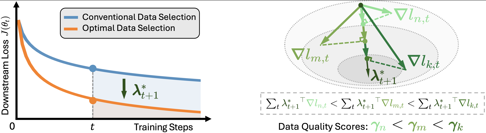
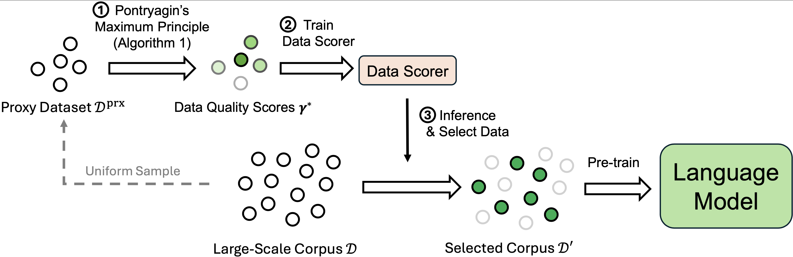

# Data Selection via Optimal Control

[paper]() | [huggingface]()

<div>Theory Overview:</div>

<div>Training Framwork PDS:</div>


## Overview of the Training Framework
1. Solve data quality scores based on a small model (160M), small total steps (100), SGD, and small proxy data (163,840 samples).
2. Fit the scores on the small proxy data with a 125M fairseq dense model (data scorer).
3. Annotate scores for large data (entire CC) with the data scorer.
4. Filter CC with the scores.
5. Pre-train the model.

## Selected Data and Pre-Trained Models
TODO

## Details of the Pipeline & How to run
The following pipeline can also be found in `scripts/pipeline.sh`.
### 0. Environment
```bash
conda create -n data_selection python=3.10
conda activate data_selection
bash install.sh
export BASE_PATH=/PATH/TO/THIS/PROJECT
# or export BASE_PATH=$PWD
```
### 1. Prepare Dataset
#### 1.1 Tokenize CC for Pre-training
First download [Redpajama CC](https://huggingface.co/datasets/togethercomputer/RedPajama-Data-1T). Then run tokenization.
```bash
bash $BASE_PATH/scripts/tools/process_cc.sh $BASE_PATH
```
#### 1.2 Convert tokenized CC for data scorer inference if the data scorer and pre-training use different tokenizer
```bash
bash $BASE_PATH/scripts/tools/convert_tokenization.sh $BASE_PATH
```
#### 1.3 Sample proxy data
```bash
bash $BASE_PATH/scripts/tools/sample_proxy_data.sh $BASE_PATH
```
### 2. Pre-train the small model for the initialization of PMP-Solver (also is the 160M baseline)
```bash
bash $BASE_PATH/scripts/pretrain/160M_bsl.sh $BASE_PATH
```
### 3. Solve Gamma
#### 3.1 Prepare data for PMP-Solver
First download [lima](https://huggingface.co/datasets/GAIR/lima). Then run tokenization.
```bash
bash $BASE_PATH/scripts/tools/process_data/lima.sh $BASE_PATH
```
#### 3.2 Run PMP-Solver
```bash
bash $BASE_PATH/scripts/pmp_solver/160M.sh $BASE_PATH
```

### 4. Train data scorer
#### 4.1 Get pre-trained checkpoints for initialization
```bash
python3 $BASE_PATH/tools/get_checkpoints.py # fairseq 125M. Base model of the data scorer
```
#### 4.2 Prepare data for data scorer training
```bash
bash $BASE_PATH/scripts/tools/prepare_data_scorer_train_data.sh $BASE_PATH
```
#### 4.3 Train data scorer
```bash
bash $BASE_PATH/scripts/data_scorer/train.sh $BASE_PATH
```

### 5. Use the data scorer to score examples
```bash
bash $BASE_PATH/scripts/data_scorer/infer.sh $BASE_PATH
```

### 6. Select the final pre-training data based on the data quality scores
```bash
bash $BASE_PATH/scripts/tools/select_pretrain_data.sh $BASE_PATH
```

### 7. Pre-train the model
```bash
# bash $BASE_PATH/scripts/pretrain/160M_bsl.sh $BASE_PATH # already pre-trained
bash $BASE_PATH/scripts/pretrain/160M_pds.sh $BASE_PATH
bash $BASE_PATH/scripts/pretrain/470M_bsl.sh $BASE_PATH
bash $BASE_PATH/scripts/pretrain/470M_pds.sh $BASE_PATH
bash $BASE_PATH/scripts/pretrain/1B_bsl.sh $BASE_PATH
bash $BASE_PATH/scripts/pretrain/1B_pds.sh $BASE_PATH
bash $BASE_PATH/scripts/pretrain/1.7B_bsl.sh $BASE_PATH
bash $BASE_PATH/scripts/pretrain/1.7B_pds.sh $BASE_PATH
```

### 8. Evaluate the models
#### 8.1 Prepare dclm data
First download [dclm](https://github.com/mlfoundations/dclm/). Then run tokenization.
```bash
bash $BASE_PATH/scripts/tools/process_data/dclm.sh $BASE_PATH
```
#### 8.2 Run evaluation
```bash
for model_size in 160M 470M 1B 1.7B
do
bash $BASE_PATH/scripts/eval_offline/lm_harness/${model_size}_bsl.sh $BASE_PATH
bash $BASE_PATH/scripts/eval_offline/lm/${model_size}_bsl.sh $BASE_PATH
bash $BASE_PATH/scripts/eval_offline/lm_harness/${model_size}_pds.sh $BASE_PATH
bash $BASE_PATH/scripts/eval_offline/lm/${model_size}_pds.sh $BASE_PATH
done
```


## 9 Citation
TODO