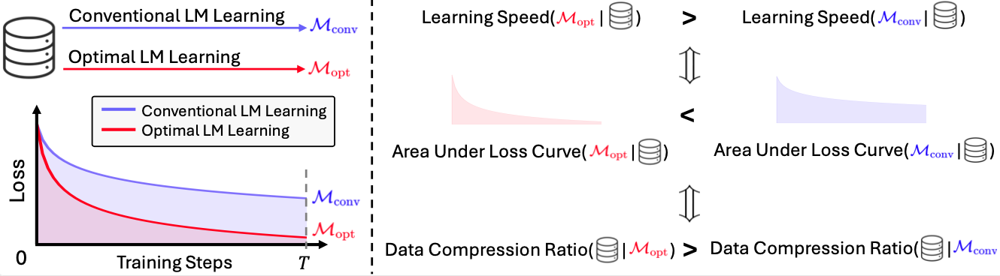
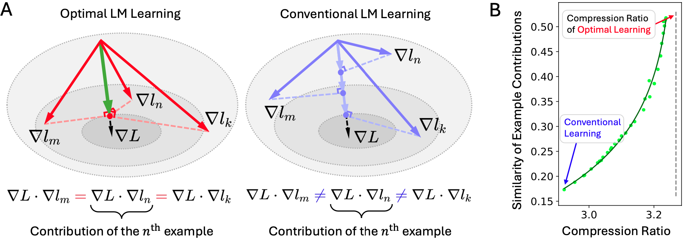

# Towards Optimal Learning of Language Models

Obejctive


A: Learning Law. B: Empirical Evidence.



## 1 Environment
The following packages are required:
```
numpy
torch
matplotlib
wandb
cvxpy
transformers
```
Or simply:
```bash
pip3 install -r requirements.txt
```

## 2 Data
The training data of Perceptron Linear Classification and Transformer Language Modeling can be downloaded from this [link](https://unilm.blob.core.windows.net/lmops/learning_law.tar). The data should be placed in `data/linear` and `data/tinystory`.


## 3 Learning Policy Optimization
```bash
cd src/
bash scripts/transformer/opt_policy.sh ${PATH_TO}/learning_law/src
bash scripts/perceptron/opt_policy.sh ${PATH_TO}/learning_law/src
```

## 4 Evaluating Optimized Learning Policy

```bash
cd src/
bash scripts/transformer/eval_policies.sh ${PATH_TO}/learning_law/src
bash scripts/perceptron/eval_policies.sh ${PATH_TO}/learning_law/src
```

<!-- ## 5 Citation
```bibtex
@article{learning_law,
  title={Towards Optimal Learning of Language Models},
  author={Gu, Yuxian and Dong, Li and Hao, Yaru and Dong, Qingxiu and Huang, Minlie and Wei, Furu},
  journal={arXiv preprint arXiv:2306.08543},
  year={2023}
}
``` -->