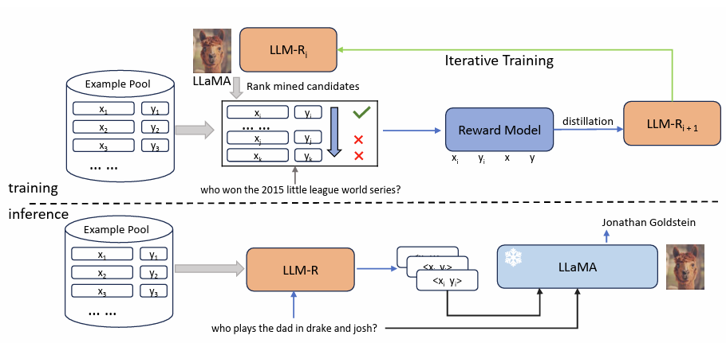

# llm-retriever

This repository contains the code for our paper [Learning to Retrieve In-Context Examples for Large Language Models](https://arxiv.org/abs/2307.07164).

Large language models (LLMs) have demonstrated their ability to learn in-context, allowing them to perform various tasks based on a few input-output examples. However, the effectiveness of in-context learning is heavily reliant on the quality of the selected examples. In this paper, we propose a novel framework to iteratively train dense retrievers that can identify high-quality in-context examples for LLMs. Our framework initially trains a reward model based on LLM feedback to evaluate the quality of candidate examples, followed by knowledge distillation to train a bi-encoder based dense retriever. Our experiments on a suite of 30 tasks demonstrate that our framework significantly enhances in-context learning performance. Furthermore, we show the generalization ability of our framework to unseen tasks during training. An in-depth analysis reveals that our model improves performance by retrieving examples with similar patterns, and the gains are consistent across LLMs of varying sizes.



## Prerequisites

### Download Data

Please run the following command to download our preprocessed data from HuggingFace Datasets.

```shell
bash scripts/download_data.sh
```

You can browse the dataset at `https://huggingface.co/datasets/intfloat/llm-retriever-tasks`.

We also provide a script at `misc/format_all_tasks.py` to convert the original data format to the one used in our codebase.

### Install Dependencies

```shell
pip install -r requirements.txt
```

## Evaluate Our Released Checkpoint

Specify the output directory with `OUTPUT_DIR` and run the following command to evaluate our released checkpoint `intfloat/llm-retriever-base`.

```shell
OUTPUT_DIR=outputs/llm-retriever-base/ bash scripts/eval_retriever.sh intfloat/llm-retriever-base
```

## Train from Our Released Reward Model Scores

To reproduce our best reported results in the paper,
you can use the following command to train a retriever from our released reward model scores.

```shell
OUTPUT_DIR=outputs/repro_llmr_it2/ bash scripts/train_kd_biencoder.sh
```

## Generate Training Data with LLaMA-7B

To generate training data from LLM feedback,
you can use the following command to generate a scoring file with LLaMA-7B.
It works by scoring the top candidates from BM25 retrieval results.

```shell
bash scripts/gen_llm_score.sh huggyllama/llama-7b bm25_train
```

It should produce a new scoring file at `data/tasks/llama-7b_bm25_train.jsonl.gz`.

## Train Reward Model from Scratch

After you have generated training data with LLaMA-7B,
you can use the following command to train the reward model.

```shell
OUTPUT_DIR=outputs/repro_reward_it1/ bash scripts/train_reward.sh
```

## Iterative Training

Use the below command to retrieve a new set of top-k candidates with a trained retriever,
and then follow the training data generation process for iterative training. 

```shell
OUTPUT_DIR=outputs/search_topk/ bash scripts/search_topk.sh /path/to/trained/retriever
```

## Citation

If you find this repository useful, please cite our paper:

```bibtex
@article{wang2023learning,
  title={Learning to Retrieve In-Context Examples for Large Language Models},
  author={Wang, Liang and Yang, Nan and Wei, Furu},
  journal={arXiv preprint arXiv:2307.07164},
  year={2023}
}
```

## Issues

Please feel free to open a GitHub issue if you have any questions or find any bugs.
