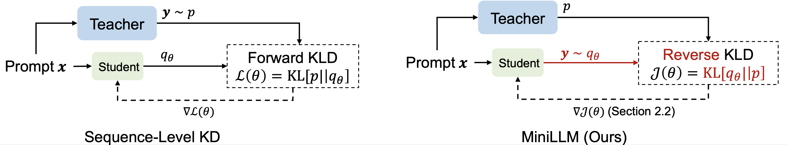

# MiniLLM: Knowledge Distillation of Large Language Models


## 1 Environment
```bash
pip3 install -e transformers/
pip3 install torch==2.0.1
pip3 install deepspeed==0.10.0
pip3 install torchvision==0.15.2
pip3 install nltk
pip3 install numerize
pip3 install rouge-score
pip3 install torchtyping
pip3 install rich
pip3 install accelerate
pip3 install datasets
pip3 install sentencepiece
pip3 install protobuf==3.20.3
pip3 install peft
```
or
```bash
bash install.sh
```

Our code is based in [this commit](https://github.com/huggingface/transformers/commit/85fde09c97213bf7e8625f83096bb2a9e183f987) of HuggingFace Transformers.

## 2 Data
### 2.1 Resources
+ The training/evaluation intruction-response data before processing can be downloaded via:
```bash
DLINK=$(echo -n "aHR0cHM6Ly9jb252ZXJzYXRpb25odWIuYmxvYi5jb3JlLndpbmRvd3MubmV0L2JlaXQtc2hhcmUtcHVibGljL01pbmlMTE0vZGF0YS50YXI/c3Y9MjAyMy0wMS0wMyZzdD0yMDI0LTA0LTEwVDEzJTNBMTElM0E0NFomc2U9MjA1MC0wNC0xMVQxMyUzQTExJTNBMDBaJnNyPWMmc3A9ciZzaWc9NGNYSklqVlJaSElCV3FIalBnRG4lMkYwMW9jenBEV1hpcG1QQ1VrM1o4dmJRJTNE" | base64 --decode)
wget -O data.tar $DLINK
```
+ The plain-text corpus $\mathcal{D}_\text{PT}$ can be download from the HugginFace datasets [repository](https://huggingface.co/datasets/openwebtext). For reproducibility, we recommend you to use the following preprocessed data.
+ The processed data can be downloaded via:
```bash
DLINK=$(echo -n "aHR0cHM6Ly9jb252ZXJzYXRpb25odWIuYmxvYi5jb3JlLndpbmRvd3MubmV0L2JlaXQtc2hhcmUtcHVibGljL01pbmlMTE0vcHJvY2Vzc2VkX2RhdGEudGFyP3N2PTIwMjMtMDEtMDMmc3Q9MjAyNC0wNC0xMFQxMyUzQTExJTNBNDRaJnNlPTIwNTAtMDQtMTFUMTMlM0ExMSUzQTAwWiZzcj1jJnNwPXImc2lnPTRjWEpJalZSWkhJQldxSGpQZ0RuJTJGMDFvY3pwRFdYaXBtUENVazNaOHZiUSUzRA==" | base64 --decode)
wget -O processed_data.tar $DLINK
```


### 2.2 Data Processing
Get plain-text corpus $\mathcal{D}_\text{PT}$:
```bash
python3 tools/get_openwebtext.py
```
This script will replace the continuous `\n` in each document with a special token "<@x(x!>" and write each document in OpenWebText in a line, which is covenient for parallel processing. In `data/openwebtext/data.txt`, we give an example of the resulting format. You can follow this format to prepare other corpus beyond OpenWebText.

Tokenize the data and store them in binary files:
```bash
bash scripts/gpt2/tools/process_data_dolly.sh /PATH/TO/MiniLLM # Process Dolly Train / Validation Data
bash scripts/gpt2/tools/process_data_pretrain.sh /PATH/TO/MiniLLM # Process OpenWebText Train / Validation Data

bash scripts/opt/tools/process_data_dolly.sh /PATH/TO/MiniLLM # Process Dolly Train / Validation Data
bash scripts/opt/tools/process_data_pretrain.sh /PATH/TO/MiniLLM # Process RoBERTa Corpus Train / Validation Data

bash scripts/llama/tools/process_data_dolly.sh /PATH/TO/MiniLLM # Process Dolly Train / Validation Data
bash scripts/llama/tools/process_data_pretrain.sh /PATH/TO/MiniLLM # Process RoBERTa Corpus Train / Validation Data
```

## 3 Models
### 3.1 Resources
+ The baselines and MiniLLM models based on GPT-2 can be downloaded from this:
```bash
DLINK=$(echo -n "aHR0cHM6Ly9jb252ZXJzYXRpb25odWIuYmxvYi5jb3JlLndpbmRvd3MubmV0L2JlaXQtc2hhcmUtcHVibGljL01pbmlMTE0vZ3B0Mi50YXI/c3Y9MjAyMy0wMS0wMyZzdD0yMDI0LTA0LTEwVDEzJTNBMTElM0E0NFomc2U9MjA1MC0wNC0xMVQxMyUzQTExJTNBMDBaJnNyPWMmc3A9ciZzaWc9NGNYSklqVlJaSElCV3FIalBnRG4lMkYwMW9jenBEV1hpcG1QQ1VrM1o4dmJRJTNE" | base64 --decode)
wget -O gpt2.tar $DLINK
```
+ The baselines and MiniLLM models based on OPT can be downloaded from this:
```bash
DLINK=$(echo -n "aHR0cHM6Ly9jb252ZXJzYXRpb25odWIuYmxvYi5jb3JlLndpbmRvd3MubmV0L2JlaXQtc2hhcmUtcHVibGljL01pbmlMTE0vb3B0LnRhcj9zdj0yMDIzLTAxLTAzJnN0PTIwMjQtMDQtMTBUMTMlM0ExMSUzQTQ0WiZzZT0yMDUwLTA0LTExVDEzJTNBMTElM0EwMFomc3I9YyZzcD1yJnNpZz00Y1hKSWpWUlpISUJXcUhqUGdEbiUyRjAxb2N6cERXWGlwbVBDVWszWjh2YlElM0Q=" | base64 --decode)
wget -O opt.tar $DLINK
```
+ The baselines and MiniLLM models based on LLaMA can be downloaded from this:
```bash
DLINK=$(echo -n "aHR0cHM6Ly9jb252ZXJzYXRpb25odWIuYmxvYi5jb3JlLndpbmRvd3MubmV0L2JlaXQtc2hhcmUtcHVibGljL01pbmlMTE0vbGxhbWEudGFyP3N2PTIwMjMtMDEtMDMmc3Q9MjAyNC0wNC0xMFQxMyUzQTExJTNBNDRaJnNlPTIwNTAtMDQtMTFUMTMlM0ExMSUzQTAwWiZzcj1jJnNwPXImc2lnPTRjWEpJalZSWkhJQldxSGpQZ0RuJTJGMDFvY3pwRFdYaXBtUENVazNaOHZiUSUzRA==" | base64 --decode)
wget -O llama.tar $DLINK
```

#### Base Pre-trained Models
To run fine-tuning or standard KD baselines, you need to download the model checkpoints from [Huggingface Model Hub] and put them in `checkpoints/`. For example, for gpt2-large, you can download the model from this [link](https://huggingface.co/gpt2-large/tree/main) and put them in `checkpoints/gpt2-large`.

Alternatively, you can also change the `CKPT` variable in each script to the corresponding model name to enable Transformers to download the base models automatically. For example, set `CKPT="gpt2-large"` in `scripts/gpt2/sft/sft_large.sh` causes download of the gpt2-large base model from the HugginFace model hub.

**NOTE:** 
1. LLaMA models require license and cannot be directly downloaded. 
2. If you want to use model parallel for training, it is recommended to download the models to `checkpoints` because you need to run `tools/convert_mp.py` to change their model parallel sizes (see next section).

### 3.2 Change Model Parallel Size
You can increase/decrease the tensor parallel sizes with
```bash
python3 tools/convert_mp.py \
    --input_path results/llama/train/minillm/7B-init-13B-sft \
    --source_mp_size 1 \
    --target_mp_size 4 \
    --model_type llama # choose from opt and llama
```
To use the model with Model Parallel, we provide two example scripts for [training](https://github.com/microsoft/LMOps/tree/main/minillm/scripts/llama/sft/sft_7B_mp4.sh) and [evaluation](https://github.com/microsoft/LMOps/tree/main/minillm/scripts/llama/sft/eval_main_dolly_mp4.sh).

## 4 Run Evaluation
```bash
bash scripts/gpt2/eval/run_eval.sh /PATH/TO/MiniLLM
bash scripts/opt/eval/run_eval.sh /PATH/TO/MiniLLM
bash scripts/llama/eval/run_eval.sh /PATH/TO/MiniLLM
```

## 5 Train
We provide example commands for GPT-2 models. Similar scripts for model families can be found in `scripts/opt` and `scripts/llama`. All our experiments are conducted on 16 \* 32V100, which can be reduced for small models.
Some large models require tensor parallel size = 4, which is set in the scripts with `--model-parallel` and `--model-parallel-size` options.

### 5.1 Baselines
The final checkpoints are selected by the Rouge-L scores.
#### Fine-tune the teacher models
```bash
bash scripts/gpt2/sft/sft_xlarge.sh /PATH/TO/MiniLLM
```
#### SFT Baselines
```bash
bash scripts/gpt2/sft/sft_base.sh /PATH/TO/MiniLLM
bash scripts/gpt2/sft/sft_medium.sh /PATH/TO/MiniLLM
bash scripts/gpt2/sft/sft_large.sh /PATH/TO/MiniLLM
```

#### KD Baselines
```bash
bash scripts/gpt2/kd/kd_base.sh /PATH/TO/MiniLLM
bash scripts/gpt2/kd/kd_medium.sh /PATH/TO/MiniLLM
bash scripts/gpt2/kd/kd_large.sh /PATH/TO/MiniLLM
```

#### SeqKD Baselines
Generate and process responses with the teacher:
```bash
bash scripts/gpt2/tools/generate_data_seqkd.sh /PATH/TO/MiniLLM
bash scripts/gpt2/tools/process_pseudo_data_seqkd.sh /PATH/TO/MiniLLM
```
Fine-tune the model with SeqKD:
```bash
bash scripts/gpt2/seqkd/seqkd_base.sh /PATH/TO/MiniLLM
bash scripts/gpt2/seqkd/seqkd_medium.sh /PATH/TO/MiniLLM
bash scripts/gpt2/seqkd/seqkd_large.sh /PATH/TO/MiniLLM
```

### 5.2 MiniLLM
#### Initial Checkpoints
The final checkpoints are selected by the **validation loss**.
```bash
bash scripts/gpt2/sft/sft_base.sh /PATH/TO/MiniLLM
bash scripts/gpt2/sft/sft_medium.sh /PATH/TO/MiniLLM
bash scripts/gpt2/sft/sft_large.sh /PATH/TO/MiniLLM
```

#### Train
The final checkpoints are selected by the Rouge-L scores.
```bash
bash scripts/gpt2/minillm/train_base_xl.sh /PATH/TO/MiniLLM
bash scripts/gpt2/minillm/train_medium_xl.sh /PATH/TO/MiniLLM
bash scripts/gpt2/minillm/train_large_xl.sh /PATH/TO/MiniLLM
```

### 5.3 Multi-Node training
Multi-Node training is launched by `deepspeed`. We provide an example script in `scripts/llama/sft/sft_7B_mn.sh` for multi-node training. Compared to single-node scripts, some of the `DISTRIBUTED_ARGS` are changed, and you need to specify a hostfile like `configs/hostfiles/node_0_1` to tell the script which nodes to use. For more information, please refer to HuggingFace's [tutorial](https://huggingface.co/docs/transformers/main_classes/deepspeed#the-deepspeed-launcher).


## 6 Citation
```bibtex
@article{minillm,
  title={Knowledge Distillation of Large Language Models},
  author={Gu, Yuxian and Dong, Li and Wei, Furu and Huang, Minlie},
  journal={arXiv preprint arXiv:2306.08543},
  year={2023}
}
```