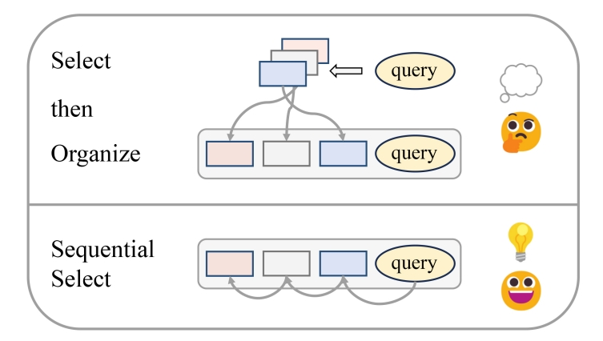

# $Se^2$: Sequential Example Selection for In-Context Learning

This repository contains the code implementation, data and checkpoint of our paper [Se2: Sequential Example Selection for In-Context Learning](https://arxiv.org/abs/2402.13874v2).

We propose **$Se^2$** (**Se**quential Example **Se**lection to improving LLM's In-Context Learning preformance), which aims to build ideal examples for In-Context Learning. **$Se^2$** differs from the traditional "select then organize/concatenate" paradigm by capturing LLM feedback on varying contexts to train a sequential-aware retriever. Meanwhile, it utilize beam search to seek and construct high-quality example sequences.


<center></center>


# Contents
* [Setup](#setup)
* [Quick Start](#quickstart)
    * [Scoring](#Scoring)
    * [Training](#Training)
    * [Inference](#Inference)
* [Questions and Discoveries Worth Exploring](#exploration)
* [Citation](#citation)

# Setup <a name="setup"></a>
```bash
conda create -n se2 python=3.7
conda activate se2
bash install.sh 
```

# Quick Start <a name="quickstart"></a>
Our pipeline contains 3 main stages: Scoring, Training, and Inference. You can start from any stages because we will provide scored data (for training) and checkpoints(for inference). We recommend that you start with the COPA task as it has a small amount of data. It takes only an hour to run through the full pipeline (with 8 V100-32GB GPUs). Let's get started!


## Get Commands
Firstly, you just need to set some directory paths and used LLMs, then get the commands for each task:

```bash
export OUTPUT_DIR=my_data # main experience folder
export CACHE_DIR=cache # folder caching the LLM checkpoints, task datasets, etc.
export SCORE_LLM='EleutherAI/gpt-neo-2.7B'  # LLM to score the data
export INF_LLM='EleutherAI/gpt-neo-2.7B'  # LLM for inference
export HYDRA_FULL_ERROR=1

tasklist=(copa arc_c arc_e openbookqa mrpc qqp paws mnli qnli snli rte sst2 sst5 sentiment140 hellaswag ag_news roc_story roc_ending gigaword aeslc common_gen e2e_nlg)
for task in ${tasklist[@]}
do 
    export TASK=${task}
    export TRAIN_CLUSTERS=${task}
    export TEST_CLUSTERS=${task}
    python get_cmds.py \
        --output_dir ${OUTPUT_DIR} \
        --model_folder "model" \
        --train_clusters ${TRAIN_CLUSTERS} \
        --test_clusters ${TEST_CLUSTERS} \
        --scr_model ${SCORE_LLM} \
        --inf_model ${INF_LLM} \
        --cache_dir ${CACHE_DIR}
done
```

The ```score.sh```, ```train.sh```, ```infer.sh``` will be saved to ```${OUTPUT_DIR}/experiment/${task}/```. Taking COPA as an example:
```bash
saved scoring cmds to:  my_data/experiment/copa/score.sh
saved training cmds to:  my_data/experiment/copa/train.sh
saved inference cmds to:  my_data/experiment/copa/infer.sh
```


## Scoring <a name="Scoring"></a>
```bash
bash ${OUTPUT_DIR}/experiment/${task}/score.sh
#such as:
bash my_data/experiment/copa/score.sh
```

**Wanna skip this step?** If you do not have enough computiong resource or time, we published our scored data, you can use it to **start training directly**.

>Since the scoring stage involves some sampling (random sampling and ranking-based sampling), we found that the sampling results varied in different hardware and software environments, so the results may have a little variance.You can train with our published data to avoid this discrepancy and get aligned performance in the paper.


## Training <a name="Training"></a>
```bash
bash ${OUTPUT_DIR}/experiment/${task}/train.sh
#such as:
bash my_data/experiment/copa/train.sh
```


**Wanna skip this step?** Also, if you don't want to train either, we published our trained checkpoint files that you can just load and then **perform inference or evaluation**.


## Inference <a name="Inference"></a>
```bash
bash ${OUTPUT_DIR}/experiment/${task}/infer.sh
#such as:
bash my_data/experiment/copa/infer.sh
```

**Wanna skip this step?** Well, you seem to have nothing to skip... : \)


Our code is largely borrowed from [UPRISE](https://github.com/microsoft/LMOps/tree/main/uprise). Thanks for their awesome codebases.


# Questions and Discoveries Worth Exploring <a name="exploration"></a>
1. Is it possible to train more **universal** retrievers based on $Se^2$ to solve more different tasks?

2. Is it possible to use stronger models or even **decoder-only** models to enhance sequential retrieval?

3. Can $Se^2$ be combined with work related to **long contexts** to extend the length of example sequences?

4. Since $Se^2$ relies on feedback from LLM, the results may be affected by the bias of LLM. Is it possible to get a fair and interpretable evaluation through **calibration** or other methods?

# Bugs or Questions?
If you have any question related to the code or the paper, feel free to open an issue or email Haoyu (`implhy@gmail.com`). Please try to specify the problem with details so we can help you better and quicker.


# Citation <a name="citation"></a>
If you find our work helpful, please cite us:
```bibtex
@inproceedings{se2,
      title={$Se^2$: Sequential Example Selection for In-Context Learning}, 
      author={Haoyu Liu and Jianfeng Liu and Shaohan Huang and Yuefeng Zhan and Hao Sun and Weiwei Deng and Furu Wei and Qi Zhang},
      url={https://arxiv.org/abs/2402.13874},
      year={2024},
}
```
