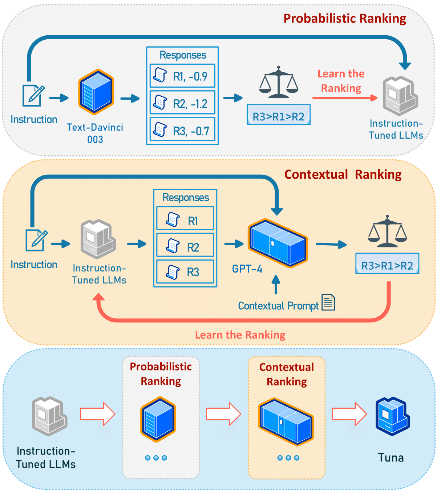

[](https://github.com/tatsu-lab/stanford_alpaca/blob/main/LICENSE)
[](https://github.com/tatsu-lab/stanford_alpaca/blob/main/DATA_LICENSE)

## Tuna: Instruction Tuning using Feedback from Large Language Models

-----
### Overview

This is the repo for the paper [Tuna: Instruction Tuning using Feedback from Large Language Models](https://arxiv.org/pdf/2310.13385.pdf) (EMNLP 2023).

<p align='center'>
    
</p>


- We propose finetuning an instruction-tuned LLM using our novel **probabilistic ranking** and **contextual ranking** approaches to increase the likelihood of generating better responses.

- Probabilistic ranking enables the instruction-tuned model to inherit the relative rankings of high-quality and low-quality responses from the teacher LLM (e.g., `text-davinci-003`).

- Contextual ranking allows the model to refine its own response distribution using the contextual understanding ability of stronger LLMs (e.g., `GPT-4`).

- Furthermore, we apply probabilistic ranking and contextual ranking sequentially to the instruction-tuned LLM, giving rise to **Tuna**.


### Data
Here we provide our training data used in the original paper:

- Probabilistic Ranking data by `text-davinci-003` (download from [here](https://drive.google.com/file/d/1QZoWeJ9zrtgshnaKzfsawOTQG6w30x3J/view?usp=drive_link))
  
  - It is based on the [Alpaca](https://github.com/tatsu-lab/stanford_alpaca) dataset, which contains 52K data.
  - Each data sample contains fields: `orig`, `text`, `avg_token_prob`, `length`, `logprob`
  - `orig`: the original Alpaca data sample (instruction, input, output)
  - `text`: the 4 responses sampled from `text-davinci-003`, given the instruction and input
  - `avg_token_prob`: the average token log probability of the 4 responses
  - `length`: the length of the 4 responses
  - `logprob`: the complete log probability of the 4 responses


- Contextual Ranking data by `GPT-4` (see `gpt_data/gpt-4-ranking.json`)
  
  - Each data sample contains fields: `prompt`, `instruct`, `generation`, `id`, `gpt_eval`, `rank_str`, `rank`, `response_4` 
  - `prompt`: the input prompt to `GPT-4`
  - `instruct`: Alpaca instruction w/ template (not used)
  - `generation`: the 4 responses generated by the model `Tuna_p`, which was finetuned with probabilistic ranking data
  - `id`: the id of the data sample
  - `gpt_eval`: the GPT-4 response to the `prompt`
  - `rank_str`: the ranking of the responses by `GPT-4`
  - `rank`: the ranking of the responses by `GPT-4` (list of int)
  - `response_4`: GPT-4's response to the instruction

- `train.davinci_003_w_prob.w_orig_alpaca.json` and `train.gpt-4-ranking.w_orig_alpaca.json` are the formatted training data for probabilistic ranking and contextual ranking training, respectively. We add the original Alpaca data in these two formatted datasets for regularization during training.

### Installation
- refer to https://github.com/AetherCortex/Llama-X

### Training

- Step 1: Supervised Finetuning

  - Use the original Alpaca data for supervised finetuning, refer to https://github.com/AetherCortex/Llama-X

- Step 2: Probabilistic Ranking

  - Use the probabilistic ranking data to finetune the model in Step 1. This model is denoted as `Tuna_p` in the paper. 
    
    - `bash src/train_tuna.sh gpt_data/train.davinci_003_w_prob.w_orig_alpaca.json 1e-5`

- Step 3: Contentual Ranking 

  - We use the model `Tuna_p` to generate responses to the Alpaca instructions, and then use `GPT-4` to rank the responses. The data is saved in `gpt_data/gpt-4-ranking.json`.

  - Use `gpt_data/train.gpt-4-ranking.w_orig_alpaca.json` to finetune the model in Step 2, 
    
    - `bash src/train_tuna.sh gpt_data/train.gpt-4-ranking.w_orig_alpaca.json 1e-6`

### Citation
If you find our code, data, or paper useful, please cite:
```
@inproceedings{tuna,
  title={Tuna: Instruction Tuning using Feedback from Large Language Models},
  author={Haoran Li, Yiran Liu, Xingxing Zhang, Wei Lu and Furu Wei},
  booktitle={EMNLP},
  year={2023}
}
```
